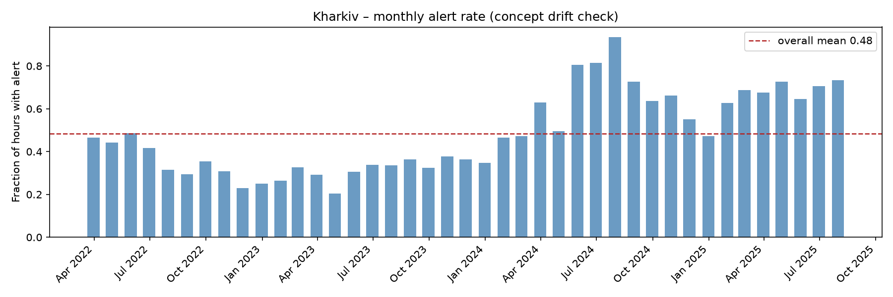
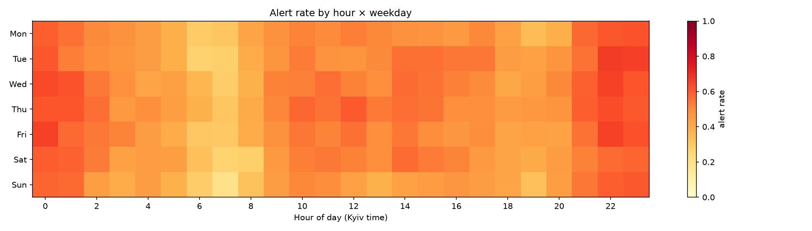
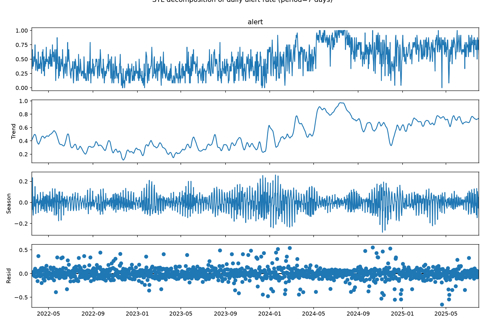
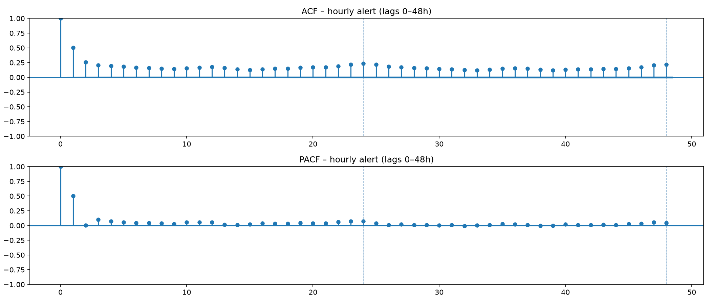
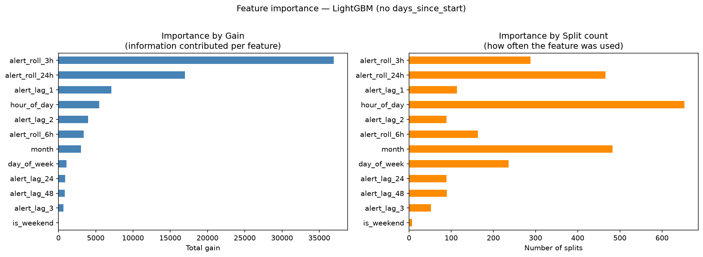

# Kizashi — Air Raid Alert Forecasting (Kharkiv)

## Problem framing
Binary hourly forecast: will there be an air raid alert in Kharkiv
in the next hour.

## Reproducing results

**Prerequisites:** Python 3.14, `python3.14-venv` (`sudo apt install python3.14-venv`).

```bash
# 1. Get the data (shallow clone to parent dir, then copy the one needed file)
git clone --depth 1 https://github.com/Vadimkin/ukrainian-air-raid-sirens-dataset.git \
    ../ukrainian-air-raid-sirens-dataset
mkdir -p data
cp ../ukrainian-air-raid-sirens-dataset/datasets/official_data_en.csv data/

# 2. Environment
python3 -m venv .venv
source .venv/bin/activate
pip install -r requirements.txt

# 3. Pipeline (run in order from project root)
python src/build_dataset.py   # raw CSV → data/kharkiv_hourly.parquet
python src/features.py        # hourly series → data/kharkiv_features*.parquet
python src/eda.py             # figures/01–04_*.png
python src/baseline.py        # persistence and majority-class metrics
python src/train_lgbm.py      # trains both LightGBM variants, saves models/, figures/
```

Outputs: `data/kharkiv_hourly.parquet`, `data/kharkiv_features.parquet`,
`data/kharkiv_features_no_drift.parquet`, `models/*.pkl`, `figures/*.png`.

## Key decisions
- **Binary target (alert yes/no per hour)** — chose occurrence over
duration/intensity to keep the target clean and the problem tractable in the 2-day scope.
- **Region: Kharkiv** — front-line, so alerts occur not only on mass-strike
days; richer signal than a deep-rear region.
- **No database** — ~29k hourly rows; flat file + pandas is sufficient, a DB would be over-engineering.
- **Data: March 2022 – August 2025 (capped at reform point)** — series truncated at the alert-system structural break (see below); longer history within this window captures seasonal and drift structure. Concept drift addressed via temporal split.
- **Imputed alert ends (naive=True) retained** — target is occurrence, not duration, so imputation noise (affecting only duration) does not affect the target. The dataset's documentation describes a `naive=True` flag for alerts with missing end signals, but the `_en` CSV does not actually expose this column; it was reconstructed by detecting exactly-30-minute durations (the documented imputation rule). Only 4 of 13,308 Kharkiv alerts flagged (~0.03%) — negligible.
- **Source=official** — original repository has two sources; decided to use `official`.
- **TZ=Europe/Kyiv** — using a named timezone instead of a hardcoded offset (UTC+2/+3) to prevent summer/winter time errors.
- **UTC time format while reasembling to hours** —  changed time format to UTC while resampling dataset to hours to avoid mistakes with two same existing hours (and moving alert one hour back/forward). After resampling dataset — changing back to local `TZ`. 
- **Series boundary by finished_at** — the hourly grid end was initially set by `started_at.max()`, which could drop the tail of a long final alert. Switched to `finished_at.max()`. (**Note:** an earlier all-data version pulled in false September 2025 data that was later cut — resolved when the series was capped at the reform point.)
- **Structural break** — alert system differentiation (2025). During EDA, the monthly alert-rate plot revealed an anomalous band of near-100% alert rate and a distorted signal from 2024–2025. Investigation (confirmed via news sources) traced this to a change in how alerts are recorded, not a change in actual strike activity — Kharkiv oblast led Ukraine in alert frequency throughout 2025. Kharkiv introduced a differentiated alert system in two stages: the `city` was separated from the `oblast` (22 Feb 2025), and the `oblast` was subdivided to `raion/hromada` level (1 Aug 2025). Threats previously logged as a single oblast-wide alert became multiple independent sub-regional records.  
**This is a structural break, not concept drift:** the unit of observation changed. Pre-reform, the target was a single oblast-wide siren; post-reform, it is the union of ~7 independent raion sirens.  
**Hypothesis tested and rejected:** I first attempted to reconstruct an oblast-wide target by aggregating alerts across all administrative levels (oblast/raion/hromada). EDA showed this produces a degenerate target — with multiple raions holding independent alert windows, their union covers nearly all post-reform hours (alert rate → ~1.0), so the signal would be almost constant and unpredictable in a meaningful sense. The aggregated signal is not equivalent to the pre-reform oblast signal.  
**Resolution:** I restricted the dataset to `level == "oblast"` records and capped the series at the reform point (~August 2025), yielding a temporally homogeneous target from March 2022 to August 2025 (~3.5 years, ~29k hourly rows) where "oblast under alert" carries a single consistent meaning throughout. This is a deliberate design choice driven by the recording-system change, not a data-availability limitation — stitching across the discontinuity would require an arbitrary cutoff and introduce new inconsistency, which is not justified for this scope.  
**Data-quality note:** two corrupt records were identified during this investigation that alone spanned every hour from June 2024 to January 2026 (the spurious 1.0 band); these were removed.  
**EDA result** — located into the **Exploratory Data Analysis** section.  
- **Holiday features were dropped:** Ukraine repeatedly shifted official holiday dates during 2022–2025 (e.g. moving Christmas to Dec 25), which standard holiday libraries do not resolve correctly per-year, risking mislabeled features. Given that EDA already showed calendar signals (including day-of-week) to be weak secondary predictors, an unreliable holiday feature was judged not worth the noise.  
- **Copy of kharkiv_features.parquet** — made it before modeling to check whether feature has negative impact on model or not.
- **Persistence baseline off-by-one (caught & fixed)** — the persistence baseline initially used `alert_lag_1` (= alert at T−1), predicting T+1 from T−1 and skipping the current hour, which understated the baseline (0.73 PR-AUC) and inflated the model's apparent margin. Corrected to use alert at decision-time T (0.808), giving an honest comparison. The model's real edge over persistence dropped from a misleading +0.11 to a truthful +0.03.
- **Feature importance: gain, not split count** — default LightGBM importance is split-count, which inflated high-cardinality calendar features and undervalued the binary `alert_lag_1`, contradicting the ACF prediction. Switched to gain-based importance, which reconciled the picture; both are plotted for transparency.

## Data source
- **Vadimkin/ukrainian-air-raid-sirens-dataset** — Flat CSV (no api code, just cloning through git); data starting from 2022 (~13k raw Kharkiv alerts and ~29k hourly rows after gridding and capping); updated daily; MIT license — free to use. Use `official_data_en.csv` from git repository.

## Exploratory Data Analysis
After resolving the structural break, the series spans March 2022 – August 2025
(~29k hourly rows) with a **base rate of 0.48** — the oblast was under alert in
roughly half of all hours. The target is therefore close to balanced, so accuracy
is not catastrophically misleading here; nonetheless PR-AUC, F1 and recall are
reported as primary metrics, since the operational cost of a missed alert
outweighs that of a false alarm.   
**Note:** *the overall base rate (0.48) differs from the train (~0.45) and test (0.685) base rates — this reflects the genuine rise in alert intensity over time (see concept drift), not an inconsistency.*
### Monthly alert rate

The artificial collapse is gone and the series is temporally homogeneous. A genuine
upward drift in alert intensity is visible through 2024–2025, reflecting real
changes in strike activity (concept drift) — which motivates the strictly temporal
train/test split.
### Seasonality: hour-of-day × weekday

Alert probability is elevated in late-evening/night hours (≈22:00–01:00) and lowest
in early morning (≈06:00–08:00), consistently across the week. A weak day-of-week
effect is visible (mid-week nights slightly higher, weekends slightly lower), but it
is a secondary signal relative to time-of-day.
### STL decomposition  

The trend component dominates (range ≈0.2–1.0), the weekly seasonal component is weak
(amplitude ≈±0.1), and the residual is large with pronounced spikes during
intensive-strike periods. This confirms that alert dynamics are driven mainly by slow
shifts in war intensity and exogenous strike events rather than smooth calendar
cycles — bounding achievable predictability and framing the task as
conditional-probability estimation rather than deterministic forecasting.
### Autocorrelation (ACF / PACF)

Strong autocorrelation at lag 1 (≈0.50) with a sharp PACF cutoff after lag 1 indicates
an **AR(1)-like process** — the immediately preceding hour carries most of the
predictive signal. A long, low ACF tail (≈0.15 out to 48h) reflects mild
persistence/clustering, while the absence of a strong 24h peak shows daily periodicity
is weak.  

**Implication for modeling:** the previous-hour state (`alert_lag_1`, i.e. the alert at decision-time T) is expected to be the dominant feature; recent-activity lags and rolling counts add secondary signal; and a persistence baseline will be a strong competitor that the models must beat. EDA thus predicts — before any model is trained — that gains over persistence will be bounded by the exogenous nature of strikes. This prediction is revisited in the results section.  

## Features & leakage prevention
All features are constructed so that, for a row representing decision-time **T**,
only information available at or before **T** is used to predict the alert at **T+1**.  

**Feature set (13 features):**
- **Lags** (`alert_lag_1,2,3,24,48`) — alert state at T−1 … T−48. Backward-looking only.
- **Rolling means** (`alert_roll_3h,6h,24h`) — share of alert-hours in windows ending at T (inclusive).
- **Calendar of the target hour** (`hour_of_day, day_of_week, month, is_weekend`) — computed for T+1.
- **Drift** (`days_since_start`) — hours elapsed since dataset start, capturing slow intensity trend.

**Temporal anchoring (exact):** lags use data through T−1; rolling windows use data
through T inclusive; calendar features use the *schedule* of T+1 (always known in
advance — not leakage); the target is the actual alert at T+1. No feature uses the
actual alert outcome at T+1.

**Why target-hour calendar is not leakage:** the clock value of T+1 (that it will be,
e.g., 02:00 on a Friday) is deterministic and known at decision time. Only the alert
*outcome* at T+1 is unknown — and that is never used as a feature.

**Timezone note:** `hour` is stored as UTC in the parquet, while all calendar features
are computed in Europe/Kyiv. The pipeline converts on load, so values are internally
consistent; the raw column may appear shifted when inspected directly.

**Temporal split (not random):** train on the earlier period, test on the most recent — never a random shuffle, which would let the model see the future and produce inflated
scores. This also evaluates the model under the most current regime.

**Known risk — `days_since_start` under temporal split:** this monotonic feature takes values in the test set beyond any seen in training, so tree models extrapolate it as a constant. Flagged for inspection via feature importance; retained as a deliberate, documented choice.

## Models & results

Three baselines and two LightGBM variants, all evaluated on the held-out test period (Jan–Jul 2025, ~5,084 hours, test base rate 0.685). Primary metric: PR-AUC.  

| Model | PR-AUC | F1 | Recall |
|---|---|---|---|
| Majority class (always alert=1) | 0.685 | 0.813 | 1.000 |
| Persistence (alert[T] → alert[T+1]) | 0.808 | 0.833 | 0.833 |
| LightGBM (no days_since_start) | 0.840 | 0.835 | 0.874 |
| LightGBM (with days_since_start) | 0.882 | 0.840 | 0.876 |

**Baselines first.** Majority-class (always predict alert) reaches 0.685 PR-AUC — equal to the base rate, the floor any real model must clear. Persistence ("next hour = current hour") is far stronger at 0.808, exactly as the ACF analysis predicted: with lag-1 autocorrelation ≈0.5, most of the signal is short-term inertia.  

**LightGBM vs persistence.** Without the drift feature, LightGBM reaches 0.840 — a **modest but real +0.03 over honest persistence**. This confirms the EDA prediction: the predictable structure is largely the short-term persistence the ACF identified, and gains beyond it are bounded by the exogenous nature of strikes (decided by the attacker, not encoded in past alert timing). The model learns something beyond inertia, but not dramatically — and that is the honest ceiling, not a failure.

**Feature importance (by gain).**



Measured by *gain* (information contributed), the dominant features are the recent-state group — `alert_roll_3h`, `alert_roll_24h`, and `alert_lag_1` — consistent with the AR(1)-like structure found in EDA. Note: `alert_roll_3h` ranks above the raw `alert_lag_1` because the 3-hour window absorbs the same recent-state signal in a slightly richer form. The initial *split-count* importance was misleading — it inflated high-cardinality calendar features (`hour_of_day`, `month`) simply because they offer more split points, while undervaluing the binary `alert_lag_1`. Switching to gain reconciled the picture with the ACF prediction. (Both views are plotted side by side in the figure.)  

**The `days_since_start` caveat.** Adding this monotonic time feature raises test PR-AUC to 0.882 (+0.04). However, in the temporal split every test value lies *above* the training maximum, so the feature is effectively constant within the test set. Its benefit is not learned dynamics but **calibration via trend extrapolation**: it shifts all test predictions toward the higher base rate of the recent regime (test 0.685 vs training ~0.45). This is not leakage, but it is extrapolation-dependent — on a test period where intensity *fell*, the same feature could mislead. It is therefore reported separately, and the no-drift model (0.840) is treated as the principled result.  

**Selected model:** LightGBM without `days_since_start` — its gain is robust rather than dependent on trend extrapolation, and it remains interpretable.  

## Limitations

- **Deployment note (calibration, not ceiling).** The train/test intensity gap is an artifact of one fixed split during rising intensity. With periodic retraining on recent data the gap would shrink, likely improving probability *calibration* — but it would not raise the predictability ceiling, which is bounded by the exogenous nature of strikes regardless of distribution alignment.

- **Predictability ceiling is low and inherent.** Air-raid alerts are driven primarily by exogenous decisions (attacker intent, weapon availability) not encoded in the alert time-series. EDA (large STL residual, short ACF memory) predicted this, and results confirm it: the best honest model improves on naive persistence by only ~0.03 PR-AUC. The task is conditional-probability estimation, not deterministic forecasting.  

- **Concept drift between train and test.** Alert intensity rose from a training base rate of ~0.45 to a test base rate of 0.685. The temporal split deliberately preserves this (testing on the most recent, most relevant regime), but it means models are evaluated under a distribution shift — which `days_since_start` partly compensates for, imperfectly.  

- **Single region, single level.** Only Kharkiv oblast-level alerts are modeled. The 2025 differentiation reform (city/raion split) made a longer or finer-grained series infeasible within scope.  

- **Fixed 0.5 threshold.** F1/precision/recall are reported at a default threshold; an operational system favoring recall (early warning) would tune the threshold via the precision-recall curve. Left out of scope.  

- **LSTM not pursued**  — given the AR(1)-like structure and ~22k training rows, a sequence model was judged unlikely to beat gradient boosting and was deprioritized within the 2-day window.